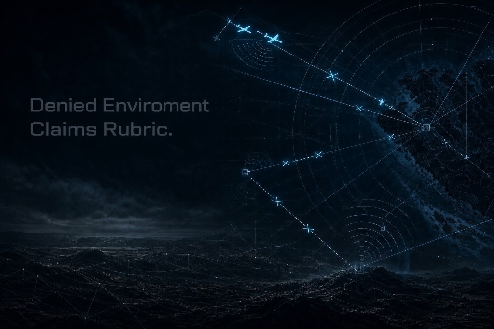

# Denied-Environment Autonomy — Public Claims Rubric

[](LICENSE)
[](CLAIMS_RUBRIC.md)

<p align="center">
  
</p>

**Thesis: low maturity is not a flaw. Low maturity with absolute language is.**

A neutral, IP-compatible rubric for evaluating public performance claims about autonomous systems under electronic warfare, GNSS denial, or datalink denial.

Nothing in it requires disclosing algorithms, mathematics, hardware topology, or any other proprietary implementation detail. It asks only for the minimum public disclosure that makes a claim evaluable: maturity, denial assumptions, sensor dependencies, error growth, environmental limits, and evidence class.

The goal is better engineering communication, not public prosecution. Apply the
same standard to your own work before applying it to anyone else's.

## Score a claim

Start with **[CLAIMS_RUBRIC.md](CLAIMS_RUBRIC.md)**, then use the
[claim worksheet](templates/CLAIM_WORKSHEET.md) to record the claim, evidence,
limits, and score. Score six dimensions 0–2 each (max 12).

| Total | Reading |
| --- | --- |
| 0–4 | Marketing. Unverifiable by construction. |
| 5–8 | Directional. Engineering content present; not yet checkable. |
| 9–12 | Reviewable. A qualified reader can bound the claim and knows what would falsify it. |

**Absolute-language override:** any unbounded absolute — *immune, unjammable, unspoofable, guaranteed, 100%, zero drift, any threat, any environment* — scores the dimension it touches **0**. Bounded evidence cannot support unbounded claims.

## What this is / is not

| This is | This is not |
| --- | --- |
| A public scoring rubric for claim discipline | A technical specification or product |
| Compatible with NDA-protected IP | A demand for equations or hardware topology |
| Applicable to air, ground, and maritime autonomy | An endorsement of any named system |
| Versioned, challengeable, MIT-licensed | Field certification or regulatory guidance |

## Worked example

The rubric includes a self-score of [HEEL-G RUT](https://github.com/Fratres-X-AI/RUT) (11/12) — an open ground-traversability layer, not an EW system — to show that the rubric penalizes language/evidence mismatch, not low maturity.

Additional reusable material:

- [Evidence manifest](templates/EVIDENCE_MANIFEST.json) — a public-safe schema for
  recording test class, sample size, conditions, and pass/fail criteria.
- [Honest technical announcement](templates/PUBLIC_POST_TEMPLATE.md) — a
  copyable format for publishing progress without overclaiming.
- [Worked scoring examples](examples/WORKED_EXAMPLES.md) — bounded, anonymized
  examples across concept, bench, and field evidence.
- [Contribution guide](CONTRIBUTING.md) — how to improve the rubric without
  turning it into a company or person rating system.

## Citation

```bibtex
@misc{fratres_claims_rubric,
  title        = {Denied-Environment Autonomy: Public Claims Rubric},
  author       = {{Fratres X AI}},
  year         = {2026},
  howpublished = {\url{https://github.com/Fratres-X-AI/Denied-Environment-Claims-Rubric}},
  note         = {Version 0.1}
}
```

## License

[MIT](LICENSE) — © Fratres X AI. Reuse with attribution welcome.
